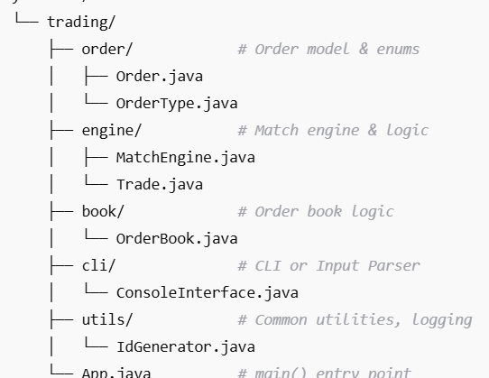
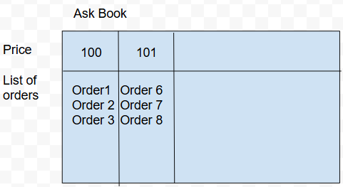
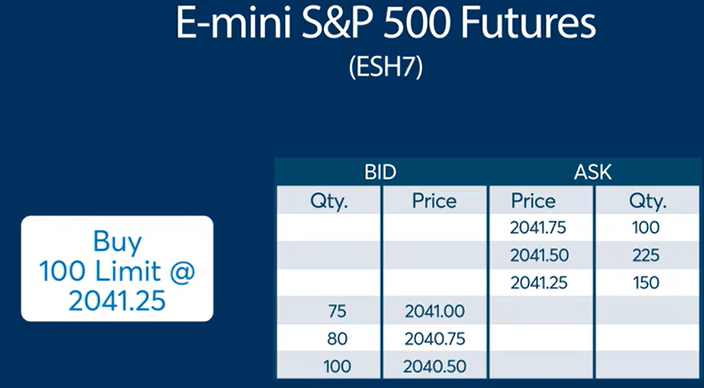

# Design of Exchange

## 1. Components

### 1.1 Order
Represent a single buy or sell order.
Fields:
- orderId: int
- price: int
- quantity: int
- timestamp: long

### 1.2 OrderBook
Contains two sorted map: Buy orders & Sell orders (FIFO)

- Buy/Bid:
  - key: price (sorted by price descending)
  - value: list (sorted by timestamp)
- Sell/Ask:
  - key: price (sorted by price ascending)
  - value: list (sorted by timestamp)

Methods:
- addOrder(order)
- cancelOrder(order)
- getOrderById(orderId)

### 1.3 MatchEngine
Control the matching process, routes incoming orders to the correct order book. FIFO

- MatchEngine: match buy & sell orders (FIFO)
- Trade: when a match succeeds, an immutable

The process for the matching:
- an incoming order matches the opposite orders in the order book
- match the quantity

### 1.4 CLI
Client interface, for user input

### 1.5 Logger
